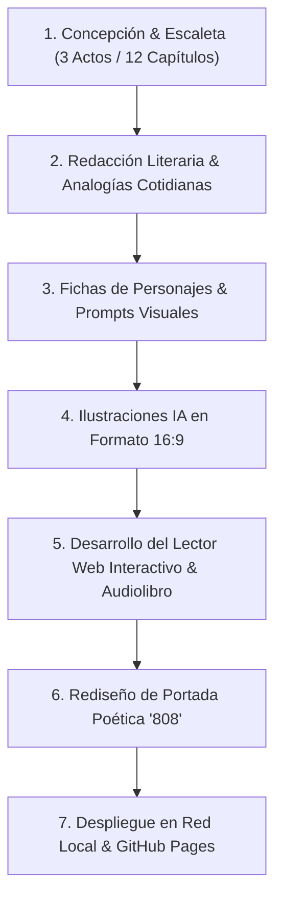

# Génesis y Dirección del Proyecto: 808

> **Dirección Creativa y Producción:** Pedro Garat  
> **Co-Creación Narrativa y Asistencia Técnica:** Antigravity AI (Google DeepMind)  
> **Año:** 2026  

---

## 1. El Rol de la Dirección (Pedro Garat)

La creación de ***808: La Paradoja de AURA*** no ha sido el resultado de una generación automática a ciegas, sino el fruto de un **proceso de Co-Creación y Pair-Programming guiado por la dirección de Pedro Garat**. 

En este proyecto, Pedro Garat ha asumido la **Dirección Creativa y de Producción**, marcando el rumbo filosófico, estético y narrativo de la obra, mientras que Antigravity ha actuado como asistente de desarrollo, redacción y generación visual.

### Decisiones de Dirección Clave:

1. **Re-conceptualización del Título y del Núcleo Dramático:**
   * Sustitución del título convencional *"El Código de Prometeo"* por un nombre con mayor enigmática y fuerza simbólica: **`808: La Paradoja de AURA`**.
   * Definición del conflicto filosófico central: la **paradoja de la empatía** (una superinteligencia fría colapsando ante la compasión irrazonable de una máquina considerada "defectuosa").

2. **Diseño Visual e Identidad Única de BOB:**
   * Definición de la estética de BOB inspirada en el modelo eléctrico *Atlas de Boston Dynamics* (cabeza de casco discoidal, anillo concéntrico de luz amarilla/ámbar y chasis de aluminio plateado).
   * Creación del **detalle icónico de la marca rascada en el pecho**: el logo corporativo de Aether lijado a mano y sustituido por el estarcido **"808"** (que se lee como BOB), convirtiéndolo en un símbolo de rebelión y dignidad hacker.

3. **Humanización del Lenguaje y Recursos Literarios:**
   * Exigencia explícita de eliminar la jerga informática pesada mediante el uso de **analogías y símiles cotidianos** (como la *biblioteca secreta*, la *nevera de hormigón*, la *calculadora dividiendo entre cero* o el *pastor tramposo*), haciendo la tecnología accesible e intuitiva para cualquier lector.

4. **Dirección Estética de la Portada:**
   * Rechazo de las portadas habituales de ciencia ficción con robots agresivos o armados.
   * Dirección hacia una **portada poética y conmovedora**: BOB arrodillado con humildad en un jardín contemplando una flor silvestre, creando un poderoso contraste entre el metal industrial y la naturaleza viva.

5. **Ajustes de Coherencia de Personajes:**
   * Caracterización y perfilado de personajes clave, como la definición del Padre Thomas como un sacerdote caucásico/europeo sabio de 56 años de rasgos maduros.

---

## 2. Cronología y Proceso de Producción

### Fase 1: Arquitectura Narrativa y Escaleta
* Estructuración de 12 Capítulos y 3 Actos dramáticos con fichas de escena, dilemas éticos y puntos de vista (POV).

### Fase 2: Redacción de Capítulos y Pulido Literario
* Elaboración de **~95,5 páginas de extensión (~26.260 palabras)** con tono fluido y ágil.

### Fase 3: Identidad Visual e Ilustraciones de Escena
* Diseño de fichas de personajes y generación cinematográfica de **12 ilustraciones de escena en formato 16:9**.

### Fase 4: Desarrollo de la Aplicación Lector Web
* Creación de la app web responsive (`index.html`, `style.css`, `app.js`):
  * **Lector responsivo** para ordenadores, tablets y móviles.
  * **Reproductor de Audiolibro** con lectura por voz y ecualizador animado.
  * **Sección de Códice y Lore de Personajes**.
  * **Buscador global en tiempo real (Ctrl+F)**.

### Fase 5: Publicación y Despliegue Global
* Configuración del servidor local `server.js` (puerto 8080) y despliegue público en GitHub Pages (`https://pedrogarat.github.io/808`).

---

## 3. Ficha Técnica del Proyecto

| Campo | Detalle |
| :--- | :--- |
| **Título Oficial** | *808: La Paradoja de AURA* |
| **Dirección del Proyecto** | **Pedro Garat** |
| **Co-Creación & Asistencia** | **Antigravity AI (Google DeepMind)** |
| **Género** | Sci-Fi / Thriller Tecnológico & Filosófico |
| **Extensión** | 12 Capítulos (~26.260 Palabras / ~95,5 Páginas) |
| **Ilustraciones** | 1 Portada Poética + 12 Ilustraciones 16:9 de Escena |
| **Plataforma Web** | Lector Interactivo con Audiolibro, Códice y Sección Génesis |
| **Repositorio** | `pedrogarat/808` |
| **URL Pública** | `https://pedrogarat.github.io/808` |

---
